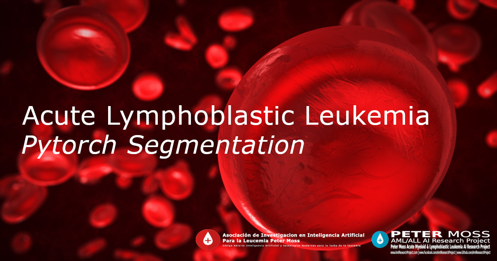

# Peter Moss Acute Myeloid & Lymphoblastic Leukemia AI Research Project
## Acute Lymphoblastic Leukemia Pytorch Segmentation 2021

      
 

&nbsp;

# Table Of Contents

- [Peter Moss Acute Myeloid & Lymphoblastic Leukemia AI Research Project](#peter-moss-acute-myeloid--lymphoblastic-leukemia-ai-research-project)
  - [Acute Lymphoblastic Leukemia Pytorch Segmentation 2021](#acute-lymphoblastic-leukemia-pytorch-segmentation-2021)
- [Table Of Contents](#table-of-contents)
- [Introduction](#introduction)
- [DISCLAIMER](#disclaimer)
- [Motivation](#motivation)
- [Acute Lymphoblastic Leukemia](#acute-lymphoblastic-leukemia)
- [ALL-IDB](#all-idb)
- [Getting Started](#getting-started)
- [Contributing](#contributing)
  - [Contributors](#contributors)
- [Versioning](#versioning)
- [License](#license)
- [Bugs/Issues](#bugsissues)

&nbsp;

# Introduction
The **Acute Lymphoblastic Leukemia Pytorch Segmentation 2021** is a Pytorch segmentation model which pinpoints exactly where the cancerous cells are within images of peripheral blood samples. This project is our first project using Pytorch, and also our first segmentation project.

**DEVELOPER TO EXPLAIN/UPDATE THE PROJECT**
Acute lymphoblastic leukemia (ALL) is a sort of blood malignancy that beginnings in white platelets in your bone marrow, the delicate inward piece of your bones. It creates from juvenile lymphocytes, a sort of white platelet that is critical to your immune system.

ALL is also known as acute lymphocytic leukemia or acute lymphoid leukemia. ”Acute” means it gets worse quickly. It’s a rare type of leukemia, or blood cancer, in adults but the most common type in children.

Acute lymphoblastic leukemia invades your blood and can spread to other organs, such as your liver, spleen, and lymph nodes. But it usually doesn’t make tumors like other types of cancer.

The initiative is focused on Acute Lymphoblastic Leukemia (ALL), a serious blood pathology that can being fatal in as little as a few weeks if left untreated, most common in childhood with a peak incidence at 2-5 years of age.

&nbsp;

# DISCLAIMER

This project should be used for research purposes only. The purpose of the project is to show the potential of Artificial Intelligence for medical support systems such as diagnostic systems.

Although the model is accurate and shows good results both on paper and in real world testing, it is trained on a small amount of data and needs to be trained on larger datasets to really evaluate it's accuracy. This project is not meant to be an alternative to professional medical diagnosis.

Developers that have contributed to this repository have experience in using Artificial Intelligence for detecting certain types of cancer. They are not doctors, medical or cancer experts.

Please use this system responsibly.

&nbsp;

# Motivation

**DEVELOPER TO PROVIDE MOTIVATION FOR THE PROJECT**

&nbsp;

# Acute Lymphoblastic Leukemia
[Acute lymphoblastic leukemia (ALL)](https://www.leukemiaairesearch.com/research/leukemia), also known as Acute Lymphocytic Leukemia, is a cancer that affects the lymphoid blood cell lineage. It is the most common leukemia in children, and it accounts for 10-20% of acute leukemias in adults. The prognosis for both adult and especially childhood ALL has improved substantially since the 1970s. The 5- year survival is approximately 95% in children. In adults, the 5-year survival varies between 25% and 75%, with more favorable results in younger than in older patients.

For more information about Acute Lymphoblastic Leukemia  please visit our [Leukemia Information Page](https://www.leukemiaairesearch.com/research/leukemia)

&nbsp;

# ALL-IDB
You need to be granted access to use the Acute Lymphoblastic Leukemia Image Database for Image Processing dataset. You can find the application form and information about getting access to the dataset on [this page](https://homes.di.unimi.it/scotti/all/#download) as well as information on how to contribute back to the project [here](https://homes.di.unimi.it/scotti/all/results.php). If you are not able to obtain a copy of the dataset please feel free to try this tutorial on your own dataset, we would be very happy to find additional AML & ALL datasets.

&nbsp;

# Getting Started

To get started follow the [getting started guide](docs/getting-started.md) to find out how to fork the repository.

&nbsp;

# Contributing

Asociación de Investigacion en Inteligencia Artificial Para la Leucemia Peter Moss encourages and welcomes code contributions, bug fixes and enhancements from the Github.

Please read the [CONTRIBUTING](CONTRIBUTING.md "CONTRIBUTING") document for a full guide to forking our repositories and submitting your pull requests. You will also find information about our code of conduct on this page.

## Contributors

- [Nitin Mane](https://www.leukemiaairesearch.com/association/volunteers/nitin-mane "Nitin Mane") - [Asociación de Investigacion en Inteligencia Artificial Para la Leucemia Peter Moss](https://www.leukemiaresearchassociation.ai "Asociación de Investigacion en Inteligencia Artificial Para la Leucemia Peter Moss") AI Engineer, Aurangabad, India

&nbsp;

# Versioning

We use SemVer for versioning.

&nbsp;

# License

This project is licensed under the **MIT License** - see the [LICENSE](LICENSE.md "LICENSE") file for details.

&nbsp;

# Bugs/Issues

We use the [repo issues](issues "repo issues") to track bugs and general requests related to using this project. See [CONTRIBUTING](CONTRIBUTING.md "CONTRIBUTING") for more info on how to submit bugs, feature requests and proposals.